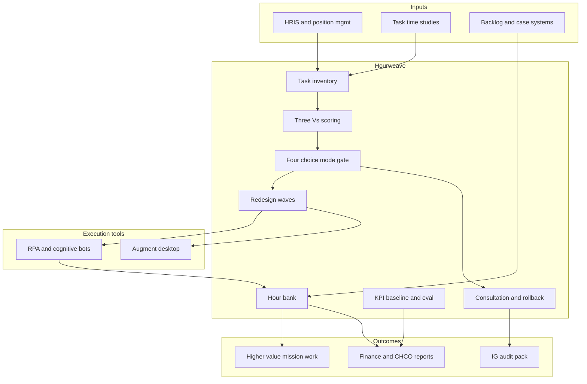

# Hourweave

**Source:** `ai-in-gov/deloitte-DUP_ai-augmented-government/`
**Domain:** `ai-gov`
**One-liner:** A civil-service work-redesign platform that maps jobs into automatable tasks, forces an explicit Relieve / Split-up / Replace / Augment choice, and banks freed hours into measurable capacity for higher-value public work.
**Wedge:** Federal and large state agencies with documented backlogs in information processing, benefits adjudication support, and contact-centre case opening — starting with O*NET-style task inventories for one job family before any headcount narrative.
**Positioning:** Workforce redesign software for government, not an RPA catalogue. Vendors sell bots; Hourweave sells the Deloitte “four automation choices” and Three-Vs (Viable / Valuable / Vital) decision discipline so leaders redeploy the 25% of labour hours cognitive tech can free — without accidental Replace strategies dressed up as efficiency.

## Market research synthesis

### Thesis from source

Deloitte’s Center for Government Insights argues that cognitive technologies will not primarily eliminate government jobs in the near term; they will change the basket of tasks inside jobs, freeing up to one quarter of many workers’ time. Using O*NET task surveys against ~4.3 billion federal hours worked, the analysis estimates automation could free 96.7 million hours annually ($3.3B) at low investment (tasks speed up ~20%) through 1.2 billion hours ($41.1B) at high investment (tasks speed up ~200%). Separate estimates put information collection alone at a half-billion staff hours and more than $16B in wages, with procuring and processing information another 280 million person-hours and $15B.

The commercially distinctive insight is not “automate more” but that *how* you automate is a leadership choice independent of the technology: **Relieve** (take mundane work so experts do higher-value work — HMRC cut handling times 40% and processing costs 80% by automating case-number opening); **Split up** (machines do as many steps as possible, humans finish and supervise — chatbots answer basics, humans take complicated responses); **Replace** (entire jobs with finite outcomes — USPS handwriting recognition sorting 18,000 pieces of mail an hour); **Augment** (humans stay in the driver’s seat with recommendations and confidence scores — Watson for Oncology style). The paper warns that Split-up can devalue professional skills (“linguistic janitorial work” for translators) and that Replace without design creates brittle citizen experiences. A parallel **cost vs value strategy** choice determines whether freed hours become layoffs or capacity. The Three-Vs framework (Viable, Valuable, Vital) further filters which processes deserve cognitive investment.

Concrete public-sector proofs populate the wedge: USCIS EMMA answering ~half a million questions per month with supervised learning; North Carolina iCenter chatbots targeting 80–90% of IT help-desk tickets; Colorado child-welfare workers at 37.5% documentation vs 9% family contact; Southern Nevada Health District inspections yielding citations in 15% of ML-prioritised inspections vs 9% randomised; DOE solar forecasting 30% more accurate. Hourweave productises the roadmap: inventory tasks, score Three-Vs, pick a four-choice mode, simulate hour banks, run redesign waves, and prove that freed capacity returned to mission work.

### Buyer & economic model

- **Primary buyer:** COO, CHCO/HR transformation lead, or CIO partnering with a program A/S at a federal agency or large state department.
- **Users:** agency workforce planners, process owners, union/employee representatives (consultation), automation CoE leads, finance (savings vs reinvestment tracking), inspector-general / internal audit (controls on Replace), supervisors of redesigned teams.
- **Budget owner / value metric:** labour and backlog budgets. Value metric is **banked hours redeployed to named higher-value activities**, not FTE deleted; secondary metrics are backlog age, quality/error rates, and employee time on mission vs documentation.
- **Competing status quo:** point RPA projects owned by IT, shadow chatbots, and consulting slideware on “AI strategy” that never forces Relieve vs Replace, never ties bots to O*NET-like task shares, and quietly converts hour savings into vacancy freezes.

### Domain constraints

- **Regulatory / trust / safety:** merit-system and labour-relations constraints on Replace; fair labour practice updates when AI is in the workplace; prohibition on pretending Augment tools are autonomous decision-makers for citizen entitlements; auditability of which tasks were automated under which choice mode.
- **Data sensitivity:** employee performance and task-time data used for redesign must not become covert productivity surveillance; citizen data in process mining stays purpose-limited.
- **Change-management realities:** aging workforce and recruiting challenges mean Replace-first messaging fails; 53% of officials already report paperwork blocking work — Relieve/Augment is the politically and operationally viable entry; pilots must show quality and speed improving together, the rare triple the source highlights.

## Business requirements

- BR-1: Every automation initiative must declare exactly one primary mode — Relieve, Split-up, Replace, or Augment — before go-live, with a recorded rationale and owner.
- BR-2: Freed hours must be banked against named receiving activities (e.g., face-to-face casework, complex adjudication) and reported monthly; hours that vanish into “efficiency” without a receiving activity fail the control.
- BR-3: Task inventories must decompose target job families into share-of-time activities with automation susceptibility scores, auditable back to the source method (O*NET-style or agency time study).
- BR-4: Candidates must be scored on the Three-Vs (Viable, Valuable, Vital) with explicit reject reasons when not proceeding.
- BR-5: Replace mode requires labour-relations and workforce-impact assessment, including residual citizen-exception handling for cases outside the automated rule set.
- BR-6: Split-up designs must identify the human residual tasks and ban unpaid “janitorial” overflow that degrades professional roles without redesign of quality standards and grading.
- BR-7: Augment recommendations that touch citizen outcomes must carry evidence citations and confidence, and must require human acceptance before action.
- BR-8: Agencies must choose and disclose a cost strategy, value strategy, or blend, so finance and CHCO share one definition of success.
- BR-9: Backlog and quality KPIs must be baselined before automation and compared after, because the source’s claim is simultaneous speed, quality, and cost — not cost alone.
- BR-10: Employee consultation records for redesign waves must be retained for labour and oversight review.
- BR-11: Commercial pricing must align to banked-and-redeployed hours and backlog reduction, not to bot licence counts that incentivise Replace by default.
- BR-12: Rollback criteria must be predefined: if error rates or citizen complaints breach thresholds, the mode can be paused without destroying the task inventory or hour-bank history.

## User stories

Canonical user stories live in sibling [USER_STORIES.md](USER_STORIES.md).

## System design

### Overview

Hourweave ingests job and process inventories, scores automation candidates with Three-Vs, requires a four-choice mode selection, estimates and then measures freed hours, assigns those hours to receiving mission activities, and runs redesign waves with consultation, KPI baselines, and rollback. Integrations push work to RPA/cognitive tools but keep strategy, hour banking, and governance in Hourweave.

### Actors & boundaries

- **Actors:** workforce planners, process owners, supervisors, employees/unions, automation CoE, finance, IG/audit, executive sponsors.
- **Trust boundary:** employee task-time and performance data stay inside HR controls; citizen case content used in process mining is minimised and segregated from employee scoring.
- **Human-in-the-loop points:** mode selection approval; Replace impact clearance; Augment acceptance on citizen-affecting actions; rollback decisions; hour-bank receiving-activity assignment.

### Core capabilities

1. **Task and job-family inventory** — time-share decomposition and susceptibility scoring.
2. **Three-Vs opportunity scoring** — Viable / Valuable / Vital with reject trail.
3. **Four-choice mode governance** — Relieve / Split-up / Replace / Augment declarations.
4. **Hour banking and redeployment** — estimate, measure, assign to receiving activities.
5. **Cost vs value strategy ledger** — disclose and track the chosen economic strategy.
6. **Wave planning and consultation** — redesign waves with labour records.
7. **Augment evidence and confidence** — recommendation objects for human acceptance.
8. **KPI baseline and evaluation** — speed, quality, cost before/after.
9. **Rollback and exception management** — pause modes, preserve history.
10. **Executive and IG reporting** — banked hours, mode mix, Replace controls.

### Conceptual data

- **Primary entities:** Agency, JobFamily, TaskActivity, OpportunityScore, AutomationModeChoice, HourBank, ReceivingActivity, RedesignWave, ConsultationRecord, StrategyElection, KpiBaseline, KpiResult, AugmentRecommendation, RollbackEvent, EmployeeImpactAssessment.
- **Critical events:** inventory published, opportunity scored/rejected, mode declared, wave started, hours banked, hours assigned, augment accepted/rejected, rollback executed, KPI evaluation closed.
- **Retention / audit needs:** mode choices, consultation, Replace assessments, and hour-bank statements retained for labour and appropriations oversight; employee-level surveillance raw data minimised and time-boxed.

### Integrations (conceptual)

- **Systems of record:** HRIS / position management, timekeeping, case and backlog systems, RPA orchestrators, cognitive service endpoints, financial performance systems.
- **Upstream signals:** O*NET or agency time studies, backlog aging extracts, quality/error feeds, union agreement constraints.
- **Downstream actions:** bot deployment tickets, staffing plan updates, receiving-queue capacity increases, executive dashboards, IG evidence packs.

### High-level architecture

### Success metrics

- **Leading:** % of automation spend with declared mode; share of banked hours with a receiving activity; Three-Vs reject rate (healthy selectivity); Augment acceptance latency; consultation completion before Replace.
- **Lagging:** measured hours freed vs 25% ambition band on targeted roles; backlog age reduction; documentation-vs-citizen-contact time shift (Colorado 37.5%/9% pattern); error/complaint rates post-wave; ratio of value-redeployed hours to cost-takeout hours.

## OpenAPI skeleton

Canonical HTTP surface lives in sibling [openapi.yaml](openapi.yaml). Summary:

- **Base path:** `/v1/...`
- **Auth:** `X-API-Key` for HRIS/RPA integration; Bearer JWT for planners and approvers.
- **Resource groups:** Inventories, Opportunities, Modes, HourBanks, Waves, Recommendations, Governance.
