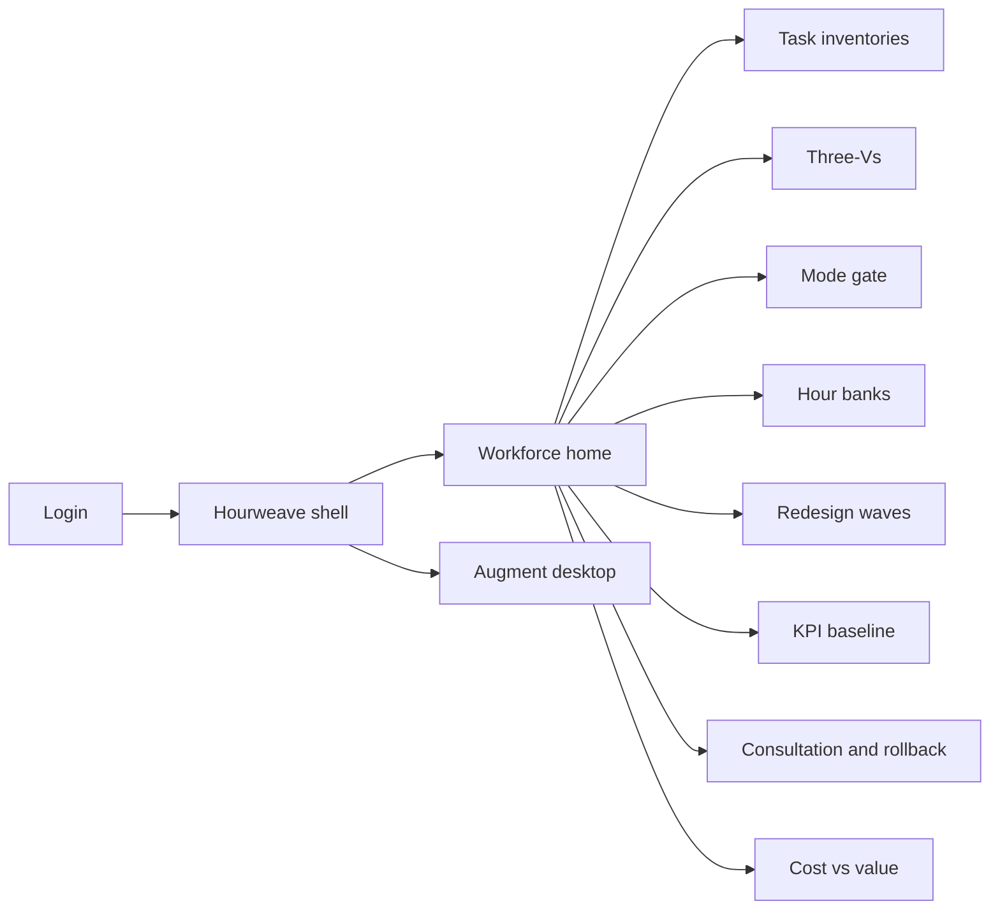
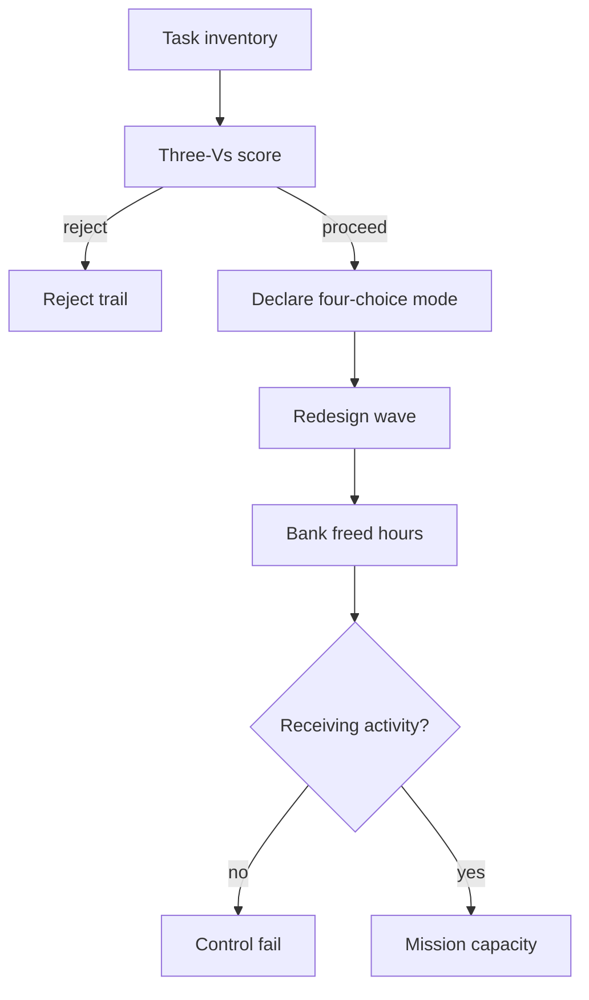

# Hourweave — Web app

**Product:** [PRODUCT.md](./PRODUCT.md)
**Primary surface:** Civil-service work-redesign console (CHCO, process owners, automation CoE)
**Secondary surfaces:** Supervisor Augment desktop; finance hour-bank statements; IG/labour evidence pack
**Design thesis:** Hourweave is a loom for public-sector hours — not an RPA storefront. Every automation initiative must declare exactly one mode (Relieve, Split-up, Replace, or Augment), bank freed hours into named receiving mission activities, and prove speed/quality/cost together. The UI metaphor is a weaving ledger: task threads enter, a four-choice mode shuttle locks, and hour banks show capacity returned to citizens — hours that vanish into vague “efficiency” fail the control. Visual language is workshop oak and loom-blue on deep charcoal — craft and accountability, not bot theatre. The Hourweave wordmark sits as a quiet capacity mark on every hour-bank and mode-gate screen.

## UX research synthesis

### Category peers (best-in-class)

- **O*NET / federal workforce analytics tools:** Task-level occupation decomposition. Steal: share-of-time inventories before vendor pitches; reject tool-first automation.
- **ServiceNow / UiPath process-mining ops (governance slice):** Wave tracking and bot inventories. Steal: wave KPI baselines; reject licence-count success metrics that bias Replace.
- **HMRC / USCIS EMMA-style service redesign case studies (as operating pattern):** Relieve case opening; supervised deflection. Steal: Relieve/Split-up as first-class modes with citizen exception paths; reject Replace-by-default.
- **Labour-relations case-file systems (conceptual):** Consultation and impact assessments. Steal: Replace blocked until consultation complete; reject silent vacancy freezes as “AI savings.”

### Patterns to adopt / reject

- **Adopt:** Task inventories with susceptibility; Three-Vs scoring with reject trail; mandatory four-choice mode; hour banks with receiving activities; cost vs value strategy disclosure; Split-up residual safeguards; Augment evidence + confidence + human accept; Replace impact assessment; pre/post KPI; rollback; consultation records.
- **Reject:** Bot catalogue as home; FTE-deleted as primary KPI; unpaid janitorial overflow normalised; Augment presented as autonomous entitlement decisions; purple “workforce AI” glow; dashboard that hides mode mix.

### Trust, density, and workflow constraints from PRODUCT.md

Employee task-time data must not become covert surveillance (minimise, purpose-limit). Replace needs labour clearance (BR-5, BR-10). Banked hours without receiving activities fail control (BR-2). Pricing aligns to redeployed hours, not bot seats (BR-11). Rollback preserves inventory and bank history (BR-12).

## Information architecture

### Nav model

### Roles → default home

| Role | Default home | Why |
|------|--------------|-----|
| Workforce planner / CHCO | Workforce home — inventories + banks | Simulate Relieve vs Replace (BR-3, BR-2) |
| Process owner | Three-Vs opportunities | Stop low-viability demos (BR-4) |
| Frontline supervisor | Augment desktop | Human acceptance on outcomes (BR-7) |
| Finance / performance | Hour-bank statements + KPI | Cost vs value honesty (BR-8, BR-9) |
| Labour relations | Replace assessments + consultation | Block premature Replace (BR-5, BR-10) |
| IG / audit | Mode log + rollbacks | Immutable governance (BR-12) |
| Automation CoE | Waves | Execute under declared mode (BR-1) |

### Cross-links to OpenAPI resources

| Nav area | OpenAPI tags / resources |
|----------|---------------------------|
| Job-family task inventories | Inventories |
| Three-Vs candidates | Opportunities |
| Relieve / Split-up / Replace / Augment | Modes |
| Freed-hour ledgers | HourBanks |
| Redesign waves | Waves |
| Augment recommendation objects | Recommendations |
| Consultation, Replace impact, rollback | Governance |

## Screen inventory

### Workforce home

- **Purpose:** Answer “where are hours banked to mission work, and which initiatives lack a mode?”
- **Entry:** Planner login.
- **Layout regions:** Brand + agency switcher; mode-mix strip; hour-bank total with receiving-activity coverage; initiatives missing mode; rollback alerts; Colorado-style documentation vs contact time widget when configured.
- **Primary actions:** Open inventory; declare mode; assign receiving activity; export CHCO pack.
- **Empty / loading / error:** Empty = import first job-family inventory.
- **BR / story ties:** BR-1, BR-2, BR-9.

### Task inventory

- **Purpose:** Decompose job families into share-of-time activities with automation susceptibility, auditable to O*NET-style method.
- **Entry:** Inventories nav.
- **Layout regions:** Job-family tree; activity table (time share, susceptibility); method citation; employee-data minimisation notice.
- **Primary actions:** Import study; edit shares; publish inventory version.
- **Empty / loading / error:** No method citation = cannot publish (BR-3).
- **BR / story ties:** BR-3.

### Three-Vs opportunity board

- **Purpose:** Score Viable / Valuable / Vital; record reject reasons.
- **Entry:** Opportunities.
- **Layout regions:** Candidate cards; VVV scores; reject trail; link to inventory activities.
- **Primary actions:** Score; reject with reason; promote to mode gate.
- **Empty / loading / error:** Healthy selectivity shows rejects, not only wins.
- **BR / story ties:** BR-4.

### Four-choice mode gate

- **Purpose:** Force exactly one primary mode with rationale and owner before go-live.
- **Entry:** From opportunity; wave setup.
- **Layout regions:** Mode selector (Relieve / Split-up / Replace / Augment); rationale; owner; mode-specific checklist (Replace impact, Split-up residuals, Augment evidence rules).
- **Primary actions:** Declare mode; lock for wave; change mode with audit (not silent).
- **Empty / loading / error:** Go-live without mode = blocked (BR-1).
- **BR / story ties:** BR-1, BR-5, BR-6, BR-7.

### Hour bank and receiving activities

- **Purpose:** Estimate and measure freed hours; assign to named higher-value activities; fail if hours vanish.
- **Entry:** Banks nav; finance.
- **Layout regions:** Bank statement; receiving-activity assignments; unassigned hours coral; cost-takeout vs value-redeploy split.
- **Primary actions:** Assign hours; close month; export statement.
- **Empty / loading / error:** Unassigned banked hours = control fail banner (BR-2).
- **BR / story ties:** BR-2, BR-8, BR-11.

### Redesign wave planner

- **Purpose:** Run waves with consultation, baselines, and execution links to RPA/cognitive tools.
- **Entry:** Waves.
- **Layout regions:** Wave timeline; consultation checklist; mode badge; bot ticket links; rollback criteria preset.
- **Primary actions:** Start wave; attach consultation; pause/rollback.
- **Empty / loading / error:** Replace wave without consultation = blocked (BR-10).
- **BR / story ties:** BR-10, BR-12.

### Augment desktop (supervisor/team)

- **Purpose:** Show recommendations with evidence and confidence; require human acceptance before citizen-affecting action.
- **Entry:** Supervisor role; agent desk integration.
- **Layout regions:** Recommendation list; evidence citations; confidence; accept/reject; never auto-execute entitlements.
- **Primary actions:** Accept; reject with reason; escalate.
- **Empty / loading / error:** Missing evidence = cannot accept (BR-7).
- **BR / story ties:** BR-7.
- **Mobile notes:** Optional tablet review; acceptance remains explicit.

### KPI baseline and evaluation

- **Purpose:** Pre/post speed, quality, cost — evidence the triple claim, not cost alone.
- **Entry:** KPI nav; wave close.
- **Layout regions:** Baseline capture; post metrics; variance; quality/complaint thresholds tied to rollback.
- **Primary actions:** Lock baseline; close evaluation; trigger rollback if breached.
- **Empty / loading / error:** Wave without baseline = cannot claim success (BR-9).
- **BR / story ties:** BR-9, BR-12.

### Replace impact and Split-up residual panels

- **Purpose:** Labour-impact assessment for Replace; ban unpaid janitorial overflow for Split-up.
- **Entry:** Mode gate detail; labour home.
- **Layout regions:** Impact assessment form; exception handling for out-of-rule cases; residual task list with grading/quality standards.
- **Primary actions:** Complete assessment; flag residual burnout; redesign quality standards.
- **Empty / loading / error:** Replace incomplete = mode lock blocked (BR-5, BR-6).
- **BR / story ties:** BR-5, BR-6.

### Governance: consultation, rollback, IG pack

- **Purpose:** Retain consultation; execute rollback without destroying history; export audit pack.
- **Entry:** Govern nav; IG.
- **Layout regions:** Consultation records; rollback events; immutable mode log; surveillance-minimisation attestation.
- **Primary actions:** Record consultation; rollback mode; export IG pack.
- **Empty / loading / error:** Rollback preserves banks/inventory (BR-12).
- **BR / story ties:** BR-10, BR-12.

### Cost vs value strategy ledger

- **Purpose:** Disclose cost strategy, value strategy, or blend so finance and CHCO share success definition.
- **Entry:** Finance.
- **Layout regions:** Strategy election; linked banks; narrative for appropriations.
- **Primary actions:** Elect strategy; report blend split.
- **Empty / loading / error:** Undisclosed strategy = amber on executive report (BR-8).
- **BR / story ties:** BR-8.

## Key flows

1. **Inventory to banked hours** — import tasks → Three-Vs → declare mode → wave → measure hours → assign receiving activity; failure: unassigned hours control fail (BR-2).

2. **Replace clearance** — select Replace → labour impact + consultation → exception handling → go-live; failure: blocked (BR-5, BR-10).

3. **Augment accept** — recommendation with evidence/confidence → human accept → action; failure: no auto-entitlement (BR-7).

4. **Rollback** — KPI/complaint breach → pause mode → preserve inventory and banks → IG visible (BR-12).

5. **Relieve simulation** — same job family → compare hour banks under Relieve vs Replace for leadership (planner story).

## Design system

### Tokens (CSS variables)

- `--color-ink: #EDE6DC` — text on charcoal
- `--color-charcoal-950: #141210` — app ground
- `--color-charcoal-900: #1E1A17` — panels
- `--color-oak: #B08D57` — accent / receiving-activity highlights
- `--color-loom: #3A6B8C` — primary actions (loom blue)
- `--color-ok: #3C8F6E` — hours assigned
- `--color-coral: #E85D4C` — unassigned hours / blocked go-live
- `--color-amber: #D4943A` — residual risk / consultation due
- `--color-steel: #9AA0A6` — secondary
- `--color-brand: #C4A574` — Hourweave wordmark (quiet oak)
- `--font-display: "IBM Plex Serif", serif` — mode names and bank totals (craft, not broadsheet layout)
- `--font-body: "IBM Plex Sans", sans-serif`
- `--font-mono: "IBM Plex Mono", monospace` — wave and bank ids
- `--space-1`…`--space-8`: 4px scale
- `--radius-sm: 4px`; `--radius-md: 8px`
- `--motion-weave: 220ms ease-in-out` — hour assign
- `--motion-mode: 180ms ease-out` — mode lock
- `--motion-rollback: 240ms ease-in` — pause wave
- Atmosphere: subtle warp/weft line texture; workshop warmth without stock “teamwork” photos; no purple automation glow.

### Typography & brand

- Serif display for mode labels and bank headlines; sans for tables; mono for ids.
- Brand on hour-bank and mode-gate views; finance exports carry brand + strategy election.
- Login: brand hero; headline (“Bank the hours. Name where they go.”); one CTA.

### Do / don’t

- **Do:** One mode per initiative; receiving activities mandatory; Three-Vs rejects visible; Replace consultation; Augment human accept; rollback history.
- **Don’t:** FTE-deleted hero KPI; bot licence home; janitorial overflow; autonomous entitlement Augment; purple AI; editable mode history.

### Accessibility & domain trust cues

- AA+; mode and bank states textual.
- Live regions for unassigned-hour failures and rollbacks.
- Focus order: inventory → Three-Vs → mode → bank → wave → KPI.
- Employee data screens announce minimisation purpose.

## Component patterns

- **ModeDeclarationGate** — Relieve / Split-up / Replace / Augment lock.
- **HourBankStatement** — freed vs assigned vs vanished.
- **ReceivingActivityAssign** — named mission queues.
- **ThreeVScoreCard** — Viable / Valuable / Vital + reject.
- **ReplaceImpactChecklist** — labour clearance.
- **SplitUpResidualFlag** — janitorial overflow warning.
- **AugmentEvidenceChip** — citation + confidence + accept.
- **WaveConsultationRecord** — labour evidence.
- **KpiBaselinePair** — pre/post speed-quality-cost.
- **RollbackPreserveBanner** — history kept on pause.
- **CostValueStrategyToggle** — disclosed economic strategy.

## Out of scope for v1 web

- Building RPA bots themselves; full HRIS replacement; citizen-facing services UI; covert productivity surveillance suites; union bargaining portal beyond consultation records.
